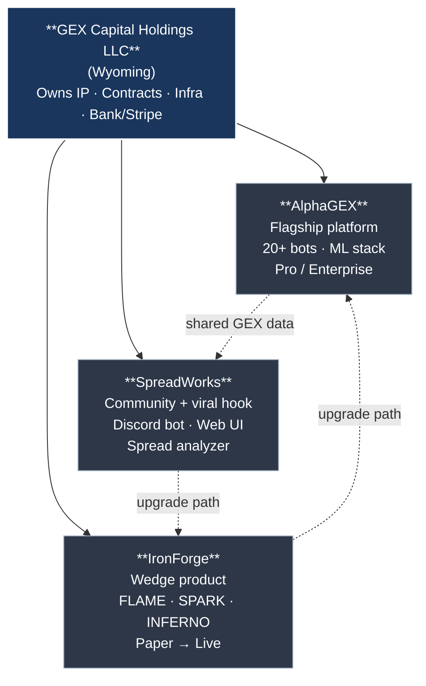
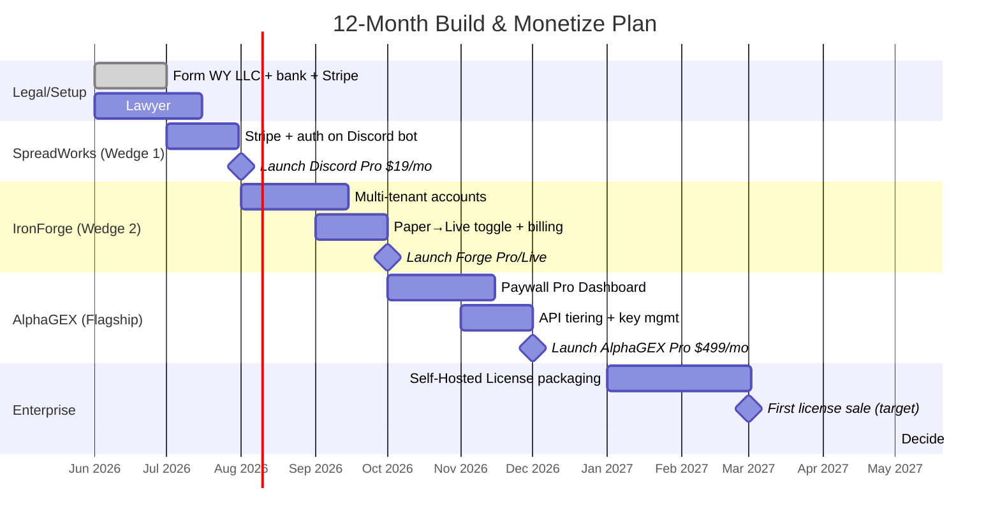
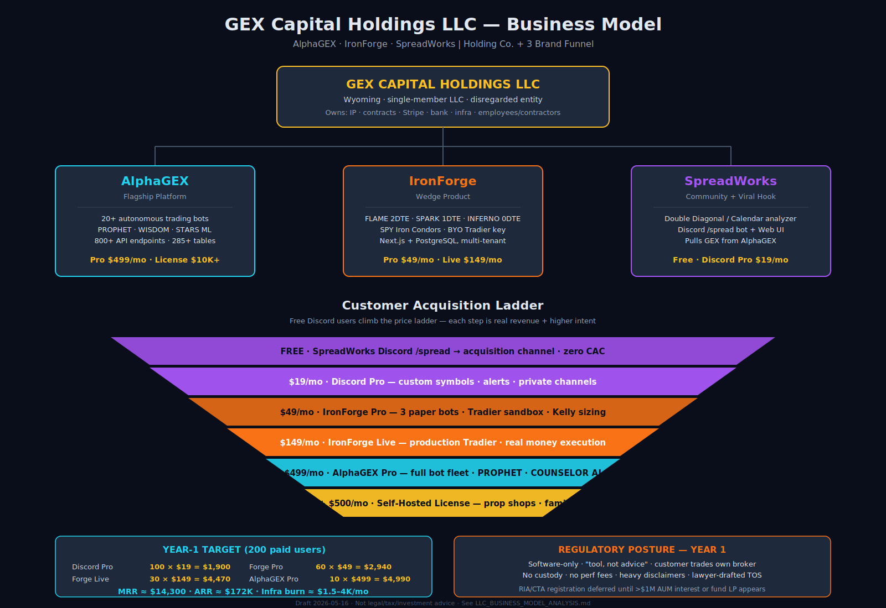

# LLC Business Model Analysis — AlphaGEX + IronForge + SpreadWorks

*Draft analysis prepared 2026-05-16. Not legal, tax, or investment advice — engage a securities attorney and CPA before forming or operating.*

---

## 1. What You Actually Own (Asset Inventory)

| Product | What It Is Today | Monetizable Asset |
|---|---|---|
| **AlphaGEX** | 20+ autonomous trading bots (options/futures/crypto), PROPHET/WISDOM/STARS ML stack, 800+ API endpoints, 285+ DB tables, ~400K LOC | Proprietary signals, ML models, GEX data pipeline, multi-broker execution, COUNSELOR AI chat |
| **IronForge** | Standalone SPY IC paper trader — FLAME (2DTE), SPARK (1DTE), INFERNO (0DTE). Next.js + PostgreSQL on Render. Real Tradier data, paper execution, PDT enforcement | Productized "starter" bot, brandable, account-per-user multi-tenant (already has User/Matt/Logan sandbox keys) |
| **SpreadWorks** | Double Diagonal & Calendar analyzer. Vite/React + FastAPI + Discord bot. Pulls GEX from AlphaGEX | Consumer/prosumer tool, Discord community hook, low-touch SaaS |

These are **three different products targeting three different buyers**, which is what makes the holding-company structure actually useful (rather than just an accounting wrapper).

---

## 2. Recommended Legal Structure

### Holding Company with DBA Brands (Lowest Friction)

```
┌─────────────────────────────────────────┐
│  PARENT LLC (Wyoming or Delaware)       │
│  e.g. "GEX Capital Holdings LLC"        │
│  - Owns IP, contracts, employees        │
│  - Files one tax return                 │
│  - Holds bank account, Stripe, infra    │
└──────────────┬──────────────────────────┘
               │ DBAs / brand operating units
   ┌───────────┼───────────┬─────────────┐
   ▼           ▼           ▼             ▼
AlphaGEX   IronForge   SpreadWorks   (future)
```

**Why this and not three separate LLCs:**
- One set of books, one tax return, one set of contractor 1099s
- IP stays in one entity → easier to sell or raise on later
- You can spin a brand into its own LLC later if it scales (no work lost)
- Wyoming = lowest fees + best privacy; Delaware = required if you ever take outside investment

### Upgrade path if you ever take real customer money for trading

The moment you manage **other people's capital** or **sell signals as advice**, the LLC alone is not enough. You need either:

- **State-registered RIA** (Registered Investment Adviser) — required in most states once you have >5 clients or hold yourself out as an adviser. ~$2-5K initial, Series 65 exam, ADV filings.
- **CTA/CPO with NFA** — required if you advise on futures (VALOR trades MES). Series 3 exam.
- **Wrap as software, not advice** — "tools and education" + customer trades their own account = SaaS, no adviser registration. **This is the cheapest path and the one I'd recommend for v1.**

> **Hard line:** if you publish "buy this strike at this price" to paying subscribers, that is advice. If you sell a tool that *they* configure and *their* broker fills, that is software. The product copy and TOS have to match the regulatory posture.

---

## 3. Revenue Model — Per Brand

### AlphaGEX (Flagship — Pro/Enterprise)

| Tier | Price | Includes |
|---|---|---|
| **GEX Data API** | $99–299/mo | Read-only GEX endpoints, WATCHTOWER snapshot, STARS probabilities. No execution. |
| **Pro Dashboard** | $499/mo | Full dashboard, PROPHET recs, WATCHTOWER signals, COUNSELOR chat (rate-limited) |
| **Self-Hosted License** | $5–25K one-time + $500/mo support | Customer runs the bots on *their* Render/AWS/Tradier accounts. You ship the code + updates. |
| **Managed Run** | revenue share (e.g., 20–30% of net profits) | Only viable post-RIA/CTA registration |

**Defensible moat:** ML models (PROPHET, WISDOM, STARS), GEX history, COUNSELOR. None of this is on a competitor's shelf.

### IronForge (Prosumer — the wedge product)

Best positioned as a **paid "starter bot" that teaches the strategy**.

| Tier | Price | Includes |
|---|---|---|
| **Free Paper** | $0 | One bot (SPARK), shared sandbox, 1 trade/day, no PDT bypass |
| **Forge Pro** | $49/mo | All three bots (FLAME/SPARK/INFERNO), bring-your-own Tradier sandbox key, full dashboard, Kelly sizing |
| **Forge Live** | $149/mo | Production Tradier connection, paper-toggleable, includes SpreadWorks Discord access |

The paper-trading nature is a feature, not a bug: it's a **legal sandbox** that doesn't trip adviser rules and a low-risk way to acquire users who later upgrade to AlphaGEX.

### SpreadWorks (Community + viral hook)

| Tier | Price | Includes |
|---|---|---|
| **Free Discord** | $0 | `/spread` slash command, daily SPY/QQQ suggestion, public channel |
| **Discord Pro** | $19/mo | Custom symbols, multiple strategies, private channel, price alert webhooks |
| **Web Pro** | $39/mo | Full StrategyPanel web UI, GEX-suggest, P&L calc, unlimited alerts |
| **Bundle w/ IronForge** | $79/mo | Discord Pro + Forge Pro |

Discord is the acquisition channel — cheap to operate, huge organic discovery via screenshots, and it pulls users up the ladder into AlphaGEX.

---

## 4. Customer Segments (who actually buys each)

| Segment | Buys | Why |
|---|---|---|
| **Retail options trader** ($1K–$50K account) | SpreadWorks Discord + IronForge Pro | Cheap, fun, learns mechanics on paper before risking money |
| **Serious self-directed trader** ($50K–$500K) | IronForge Live + AlphaGEX Pro Dashboard | Wants signals + automation in their own broker |
| **Quant hobbyist / dev** | AlphaGEX Data API | Wants GEX data to plug into their own backtests |
| **Small prop / family office** | AlphaGEX Self-Hosted License | Needs to run on own infra, can pay 5-figures |
| **Future: fund LPs** | Managed Run | Only after RIA + audited track record |

The funnel is `SpreadWorks Discord → IronForge Paper → IronForge Live → AlphaGEX Pro → Self-Hosted`. Each step is a real revenue jump and a higher-intent user.

---

## 5. Cost Structure (rough monthly, year 1)

| Bucket | $/mo | Notes |
|---|---|---|
| Render (web + 3 workers + Postgres for AlphaGEX) | $200–400 | Scales with users |
| Render (IronForge web + DB) | $50 | Single web service |
| Render (SpreadWorks 3 services) | $50 | Static + Python + Node bot |
| Tradier API (production) | $0–10 | Per-account |
| Polygon (fallback data) | $200–2,000 | Tier-dependent |
| TradingVolatility | $50–200 | GEX data source |
| Anthropic API (COUNSELOR) | $200–1,000 | Scales with chat volume — *prompt caching is critical here* |
| Tastytrade (VALOR) | $0 | Per-trade only |
| Coinbase (AGAPE) | $0 | Per-trade only |
| Stripe fees | 2.9% + $0.30 | On all subscription revenue |
| Domain / SSL / email | $20 | |
| Legal (LLC formation + TOS + privacy + disclaimers) | $2–5K one-time | Plus ~$500/yr registered agent |
| RIA registration *(if pursued)* | $2–5K one-time + $1K/yr | Skip in year 1 |
| **Total monthly (no RIA, modest scale)** | **~$1.5–4K** | Break-even at ~30–80 paid users |

---

## 6. Unit Economics (back-of-napkin)

Assume year-1 mix of 200 paid users:
- 100 × $19 Discord Pro = $1,900
- 60 × $49 Forge Pro = $2,940
- 30 × $149 Forge Live = $4,470
- 10 × $499 AlphaGEX Pro = $4,990

**MRR: ~$14,300 / ARR: ~$172K** against $30–50K of infra+ops. That's a real business, not a side project, and it gets there with zero outside capital because you're not paying CAC for sales reps.

The hockey-stick lever is the **Self-Hosted License at $10–25K one-time** — sell two or three of those a year and you double revenue.

---

## 7. Regulatory & Compliance Reality Check

**You can ship today without registration if you:**

1. Sell software/data, never make trade recommendations to specific clients
2. Bots run in customer's own broker account, customer owns the API keys
3. Disclaim everything ("for educational and research purposes, not investment advice, past performance, etc.")
4. Don't take custody of customer funds
5. Don't take performance fees

**You absolutely need a lawyer to draft:**

- Terms of Service (especially the no-advice carve-out)
- Privacy policy (you store API keys → at minimum SOC 2-lite posture)
- Risk disclaimers on every dashboard page that shows P&L
- Operating agreement for the LLC

**Yellow flags in current code/copy:**

- "PROPHET is the central ML advisory system" reads as advice — rename to "decision support" in public copy
- Performance dashboards showing real P&L need "paper" or "hypothetical" watermarks if marketing
- Discord bot output suggesting strikes is the closest you get to advice — make it explicit "this is a calculator, not a recommendation"

---

## 8. Risks & Mitigations

| Risk | Mitigation |
|---|---|
| **A bot loses real customer money via a bug** | Customer trades their own account, software has no custody. Robust kill-switches. Heavy disclaimers. E&O insurance once revenue > $50K ARR. |
| **Tradier / Polygon / TradingVolatility pricing changes** | Already have multi-provider abstraction. Pass pricing through to higher tiers. |
| **SEC/FINRA inquiry about unregistered advice** | Lawyer-reviewed TOS + the "software, not advice" framing. Keep marketing copy clean. |
| **One bot's bad track record taints all brands** | Brands are operationally separate. Bad-performing bots (XRP/SHIB per audit) get sunset or moved to "experimental" tier. |
| **Concentration in SPX/SPY** | AGAPE crypto family and VALOR futures already diversify. Roadmap: 0DTE QQQ. |
| **You getting hit by a bus / key-person risk** | Document runbooks (you already do in `.claude/rules/`). Escrow source. |

---

## 9. 12-Month Roadmap

**Q1 (now)** — Form LLC (Wyoming, ~$200 + agent). Lawyer drafts TOS, privacy, disclaimers. Stripe + auth (Clerk or Auth0). Land first 10 paying Discord Pro users on SpreadWorks as the test.

**Q2** — Productize IronForge as the wedge: per-user accounts, billing, paper→live toggle. Launch Forge Pro at $49.

**Q3** — Gate AlphaGEX Pro Dashboard behind paywall. Tier the API. Add COUNSELOR chat quotas with prompt caching to keep Anthropic costs sane.

**Q4** — First Self-Hosted License sale (target one prop shop or family office). Decide: register as RIA or stay software-only based on Q1–Q3 funnel data.

---

## 10. Open Questions for You

1. **Are you the sole owner, or are there partners?** Multi-member LLC needs an operating agreement on day 1 — single-member is much simpler taxes-wise (disregarded entity, schedule C).
2. **Where are you tax-resident?** That drives whether Wyoming/Delaware actually saves anything vs. just forming in your home state.
3. **Are you willing to do the RIA path eventually**, or is "software only, customer trades their own account" the permanent posture? This decision changes the marketing copy fundamentally.
4. **Self-funded or raising?** If raising even friends-and-family, Delaware C-corp on top of the LLC may make more sense long-term (LLCs are messy for equity rounds).
5. **Performance fees?** If yes → RIA/CTA mandatory. If no → software model holds.

Get answers to those five and the structure picks itself.

---

## 11. Visual Summary

### 11.1 Holding Company Structure



### 11.2 Customer Funnel (Acquisition → Revenue Ladder)

```
   ┌───────────────────────────────────────────────────────────────┐
   │  TOP OF FUNNEL — free, viral, low-touch                       │
   │  SpreadWorks Discord  /spread  (100% free)                    │
   │  → screenshots shared in r/options, FinTwit, YouTube clips    │
   └────────────────────────┬──────────────────────────────────────┘
                            │  $19/mo
                            ▼
   ┌───────────────────────────────────────────────────────────────┐
   │  SpreadWorks Discord Pro — custom symbols, alerts, channels   │
   └────────────────────────┬──────────────────────────────────────┘
                            │  $49/mo
                            ▼
   ┌───────────────────────────────────────────────────────────────┐
   │  IronForge Pro — 3 paper bots, BYO Tradier sandbox key        │
   └────────────────────────┬──────────────────────────────────────┘
                            │  $149/mo
                            ▼
   ┌───────────────────────────────────────────────────────────────┐
   │  IronForge Live — production Tradier, paper-toggleable        │
   └────────────────────────┬──────────────────────────────────────┘
                            │  $499/mo
                            ▼
   ┌───────────────────────────────────────────────────────────────┐
   │  AlphaGEX Pro Dashboard — full bot fleet, PROPHET, COUNSELOR  │
   └────────────────────────┬──────────────────────────────────────┘
                            │  $5–25K one-time + $500/mo
                            ▼
   ┌───────────────────────────────────────────────────────────────┐
   │  AlphaGEX Self-Hosted License — prop shops / family offices   │
   └───────────────────────────────────────────────────────────────┘
```

### 11.3 Revenue Mix at 200 Paid Users (Year-1 Target)

```
SpreadWorks Discord Pro    100u × $19  │█████████████ $1,900     (13%)
IronForge Pro               60u × $49  │████████████████████ $2,940 (21%)
IronForge Live              30u × $149 │████████████████████████████████ $4,470 (31%)
AlphaGEX Pro                10u × $499 │████████████████████████████████████ $4,990 (35%)
                                       └─────────────────────────────────────
                                          MRR ≈ $14,300   ARR ≈ $172K
```

### 11.4 Tech / Cost Map

```
┌─────────────────────────────────────────────────────────────────┐
│                    CUSTOMER (browser / Discord)                  │
└──────────────┬───────────────────┬──────────────────────────────┘
               │                   │
               ▼                   ▼
   ┌─────────────────────┐  ┌──────────────────────┐
   │  Vercel (Frontend)  │  │  Discord (bot host)  │
   │  Next.js · React    │  │  SpreadWorks bot     │
   └──────────┬──────────┘  └──────────┬───────────┘
              │                        │
              ▼                        ▼
   ┌──────────────────────────────────────────────────┐
   │                  RENDER (us-east)                 │
   │  ┌──────────┐ ┌──────────┐ ┌──────────────────┐  │
   │  │ AlphaGEX │ │IronForge │ │   SpreadWorks    │  │
   │  │   API    │ │  webapp  │ │  backend+bot     │  │
   │  └────┬─────┘ └────┬─────┘ └────────┬─────────┘  │
   │       │            │                │             │
   │  ┌────▼──────┐ ┌──▼──────┐    ┌────▼────┐        │
   │  │ Trader    │ │ Postgres│    │ Postgres│        │
   │  │ Collector │ │ (IF)    │    │ (SW)    │        │
   │  │ Backtester│ └─────────┘    └─────────┘        │
   │  └────┬──────┘                                    │
   │       │                                            │
   │  ┌────▼─────────┐                                 │
   │  │ Postgres(AG) │ 285+ tables                     │
   │  └──────────────┘                                 │
   └──────────────────────────────────────────────────┘
              │                        │
              ▼                        ▼
   ┌──────────────────┐    ┌──────────────────────┐
   │ Tradier · Polygon│    │ Anthropic (COUNSELOR)│
   │ TV · Tastytrade  │    │ Coinbase (AGAPE)     │
   └──────────────────┘    └──────────────────────┘

   Total infra burn at modest scale: ~$1.5–4K/mo
```

### 11.5 12-Month Roadmap (Gantt)



### 11.6 Decision Matrix — When to Register as RIA/CTA

```
                 SOFTWARE-ONLY              REGISTERED ADVISER
                 (cheap, fast)              (RIA + maybe CTA)
                ───────────────             ──────────────────
Cost            $0 reg                      $2–5K + $1K/yr + exam
Posture         "tool, not advice"          "fiduciary advice"
Custody         Customer's broker           Customer's broker (still)
Perf fees       NO                          YES (with caveats)
Marketing copy  No specific picks           Can recommend trades
Speed to launch Days                        3–6 months

  DEFAULT → Software-only for Year 1.
  TRIGGER → Switch ONLY when you have >$1M AUM interest or
            a fund LP asking for a managed product.
```

### 11.7 Standalone Visual (pitch-deck ready)

A full-resolution SVG of the holding company + 3-brand funnel is at:

**`docs/llc_business_model.svg`**

The SVG renders directly in GitHub, in browsers, and in Keynote/Slides (drag-and-drop). It contains:
- Holding company → 3 brand structure
- 6-tier customer acquisition ladder ($0 → $25K)
- Year-1 200-user revenue breakdown ($172K ARR)
- Regulatory posture summary




